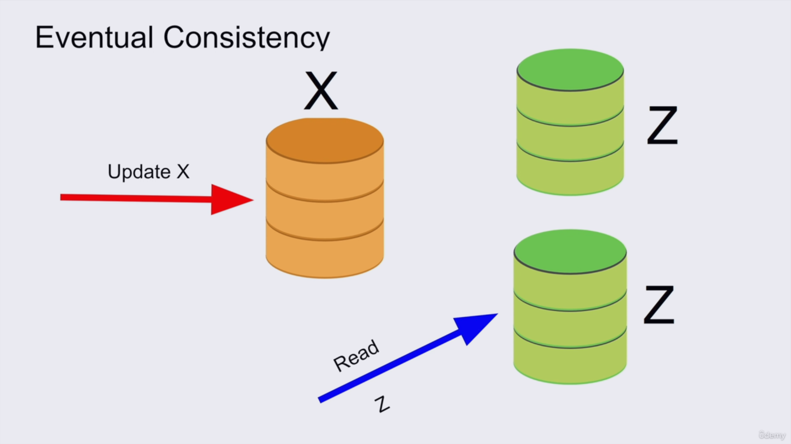
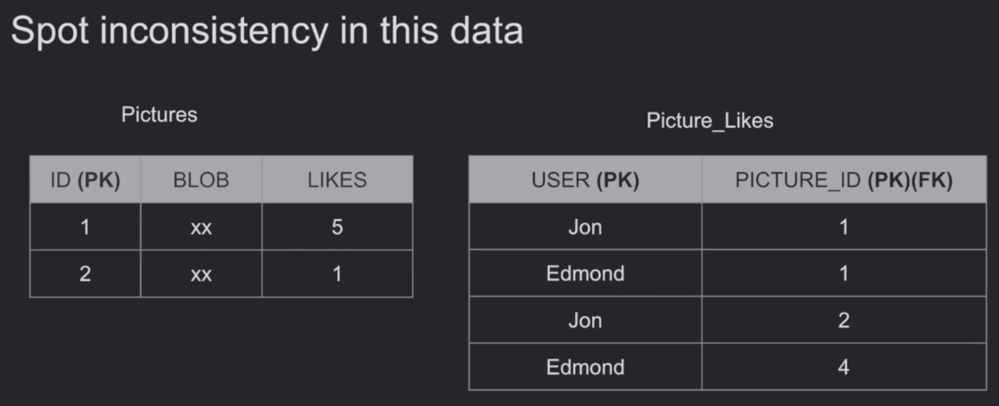

# CONSISTENCY

## What is Consistency?

**Consistency:** The data must remain valid and consistent before and after a transaction.

A transaction must take the database from one **valid state** to another **valid state**, according to the defined rules and constraints of the database.

## Types of Consistency

### Consistency in Reads

When a transaction commits a change, subsequent reads should see the new change according to the consistency guarantees provided by the database system.

In a system with **replicas**, we may have a primary server and multiple replica servers. Data can be written to the primary and then **asynchronously replicated** to the other servers.

If we read from a replica before the new changes have been replicated to it, we may read **stale data**.

SQLite can provide consistent reads more easily because it runs locally and does not typically involve multiple database replicas or remote servers.

This is related to **read consistency** in distributed systems and is different from the **Consistency** property in ACID.

### Consistency in Data

Data consistency is defined by the rules and constraints of the database.

The database should remain in a valid state after the transaction. This can be enforced through things such as:

* **Referential integrity**
* **Constraints**
* **Atomicity**
* **Isolation**
* Other database rules defined by the user

