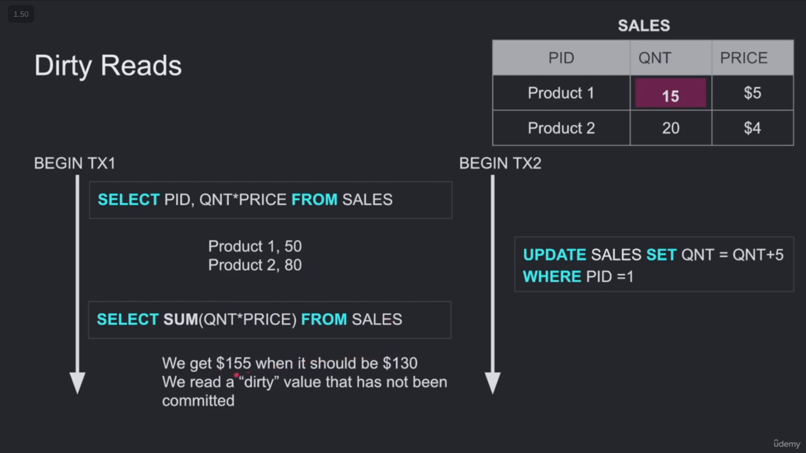
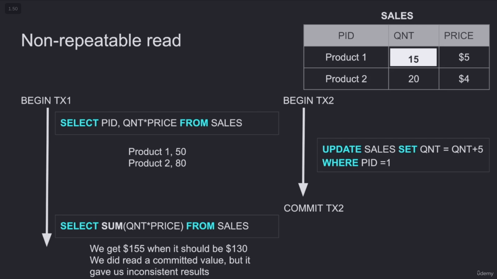
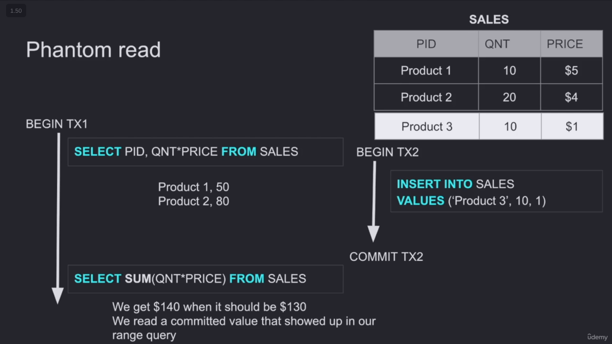
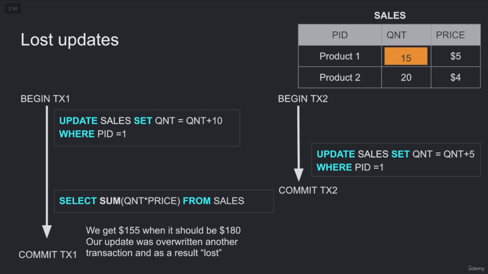

# ISOLATION

## What is Isolation?

**Isolation:** If you start a transaction, its operations should be isolated from other transactions until the transaction ends.

## Why do we think about Isolation?

We have many TCP connections to the DB, not just one user (as in SQLite), so each user can start a transaction at any time. Therefore, concurrency can happen.

Multiple transactions (users) may need to read or update the same data, which can lead to several phenomena.

## The Phenomena That Happen Because of Concurrency

* **Dirty Read:** After starting your transaction, another transaction changes the data. Then, even before this transaction commits, you read the same data.

  

* **Non-Repeatable Read:** After starting your transaction, another transaction changes the data and commits these changes. Then, after that, you read the same data.

  

* **Phantom Read:** After starting your transaction, another transaction inserts new rows and commits these inserts. Then, you want to read the entire table.

  

* **Lost Updates:** After starting your transaction, you update a row in the table. Then, another transaction comes and updates the same row. After that, you want to read the same row.

  

## Isolation Levels (Solutions)

* **Read Uncommitted:** No isolation. Any changes from outside are visible to the transaction, whether they are committed or not.
* 
* **Read Committed:** Each specific query or operation only sees committed changes made by other transactions. This is the default isolation level for PostgreSQL.

* **Repeatable Read:** The transaction will make sure that when a query reads data, this data will never be changed until the transaction finishes.
* **Snapshot:** Each query in the transaction only sees the changes that have been committed up to the start of the transaction. In PostgreSQL, every row has a version, and depending on when you start a transaction, that version stays visible to you.

* **Serializable:** Transactions are run as if each transaction runs one after another. In optimistic DBMSs, transactions are executed without locks, and if there is a conflict, the transaction is rolled back.

  
