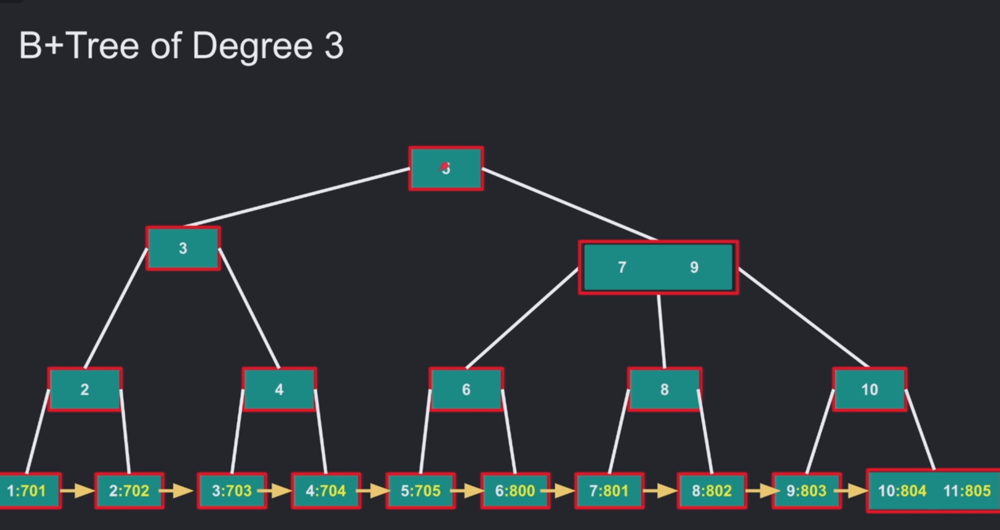

# B+TREE

## What Is a B+Tree?

A **B+Tree** is similar to a B-tree, but all values are stored in the **leaf nodes**. The root and internal nodes only store keys, while the leaf nodes store both keys and values.

If the degree is `m`, then each node can have up to `m` children and `m - 1` elements inside the node.

## What Is the Best and Worst Case for Searching for a Specific Key?

The best and worst cases both require traversing the height of the tree, which is **O(log N)**.

## What Is Stored in a Node?

In a B+Tree, **root** and **internal** nodes only store the keys.

When we reach a **leaf node**, it stores elements containing both a **key** (what you are searching for) and a **value**.

The value can be either a `row_id` in some databases or the **primary key** in other databases.

In many databases, a node is designed to fit into one logical page for performance reasons.

## Linked Leaf Nodes

Once you find a value, you can easily find all values before and after that key because the leaf nodes are linked together.

This makes B+Trees very efficient for **range queries** without requiring random access to search for every value separately.

