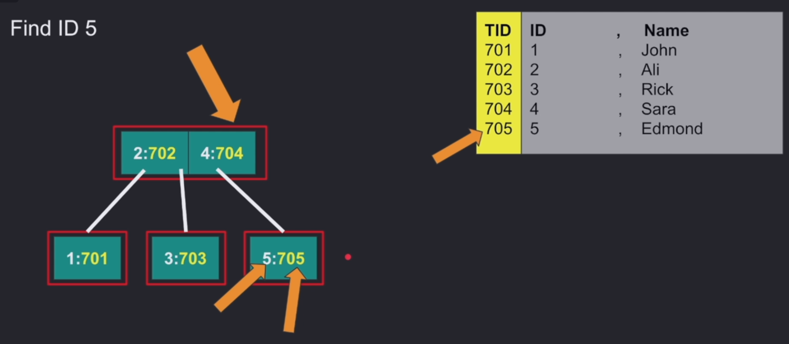

# BTREE

## What Is a BTree?

A **Btree** is a balanced tree data structure used to efficiently store and sort inserted nodes by one or multiple keys.

If the degree is `m`, then each node can have up to `m` children and `m - 1` elements inside the node.

## What Is the Best and the Worst Case for Searching for a Specific Key?
The best case is find the key you serche in the root **O(1)**.
The worst case is traversing the height of the tree, which is **O(log N)**.

## What Is Stored in a Node?

In a Btree, each node (**root, internal, and leaf**) stores elements containing both a **key** (what you are searching for) and a **value**.

The value can be either a `row_id` in some databases or the **primary key** in other databases.

In many databases, a node is designed to fit into one logical page for performance reasons.

## What Are the Limitations of a BTree?

1. **More space usage:**

   Elements in all nodes store both the key and the value. This takes more space, which means we may need more I/O operations to fetch pages.

2. **Range queries:**

   Range queries can be less efficient because we start by searching for a value and then need to continue searching for the next values in the range.

   In some Btree implementations, after finding a value, we may need to perform another search from the root to find the next value. This can lead to more random access and more I/O operations.
