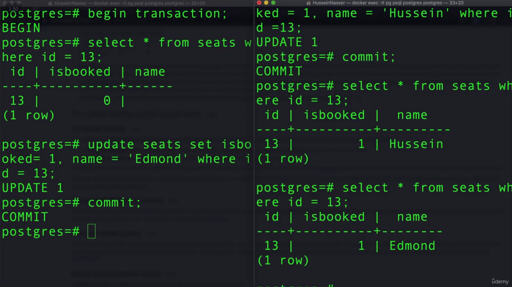

# CONCURRENCY

## Why Does Concurrency Happen?

Since we have **cloud databases**, **OLTP systems**, and many users sending requests to the database at the same time, multiple transactions can run concurrently.

These transactions may try to **read or modify the same row** at the same time, which can lead to **race conditions**.

## What Is a Race Condition?

A **race condition** happens when multiple threads, processes, or transactions access and modify the same data concurrently, and the final result depends on the order in which they execute.

This can lead to **data inconsistency** if the concurrent operations are not properly controlled.

