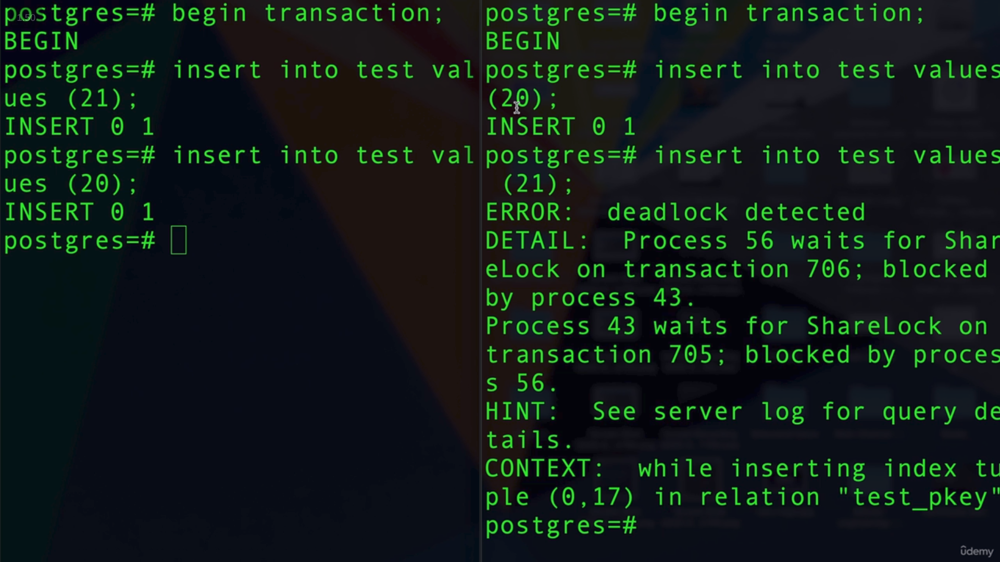

# DEADLOCKS

## When Do Deadlocks Happen?

A **deadlock** happens when two or more transactions are waiting for each other to release a resource.

Each transaction holds a resource that the other transaction needs, so none of them can continue.

This creates a **circular wait**, where every transaction is waiting for another transaction to finish, resulting in an infinite waiting cycle.

## Deadlocks in Transactions

If we have two transactions running simultaneously and both need to insert unique values:

1. **Transaction 1** → `INSERT (20)`
2. **Transaction 2** → `INSERT (21)`
3. **Transaction 2** → `INSERT (20)`
Here, **Transaction 2** needs to wait for the lock held by **Transaction 1**.

4. **Transaction 1** → `INSERT (21)`
Now, **Transaction 1** needs to wait for the lock held by **Transaction 2**.

At this point, a **deadlock** occurs because each transaction is waiting for the other to release its lock.

The DBMS detects the deadlock and **rolls back one of the transactions**. This releases its locks, allowing the other transaction to continue and complete successfully.

