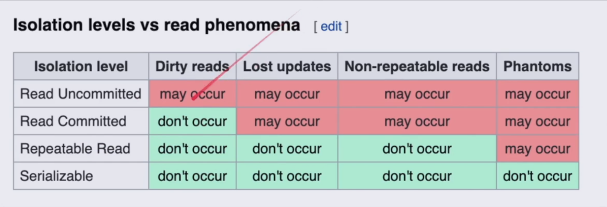

# ISOLATION LEVELS

## We Have Many Isolation Levels

* **Read Uncommitted:** No isolation. Any changes from other transactions are visible to the transaction, whether they are committed or not.

* **Read Committed:** Each specific query or operation only sees committed changes made by other transactions. This is the default isolation level for PostgreSQL.

* **Repeatable Read:** Once a transaction reads data, subsequent reads of the same data return the same version throughout the transaction.

* **Snapshot:** Each query in the transaction only sees the changes that have been committed up to the start of the transaction. In PostgreSQL, each row has a version, and depending on when you start the transaction, that version remains visible to you.

* **Serializable:** Transactions are executed as if they were running one after another. In some optimistic implementations, transactions can be executed concurrently, and if a conflict occurs, one of the transactions may be rolled back.

