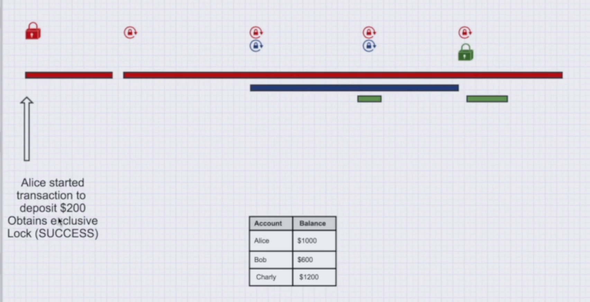
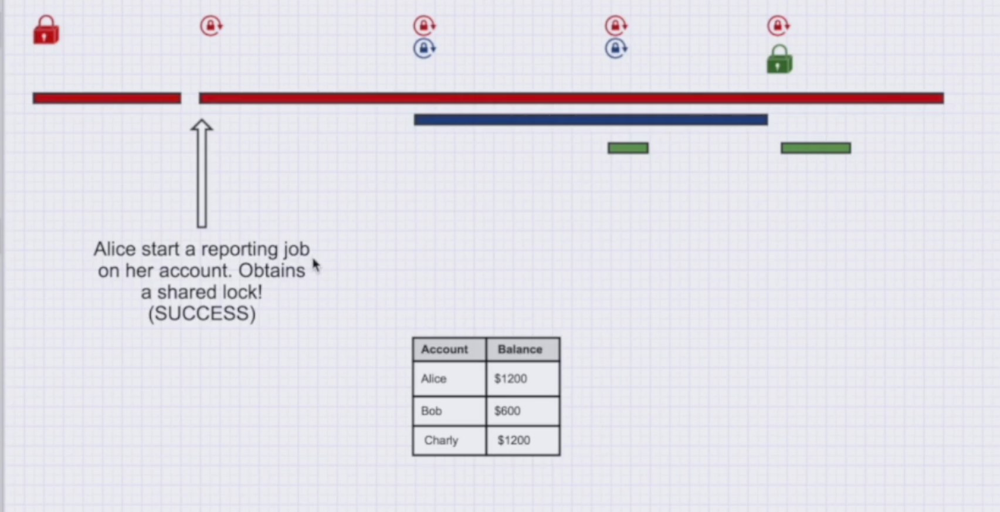
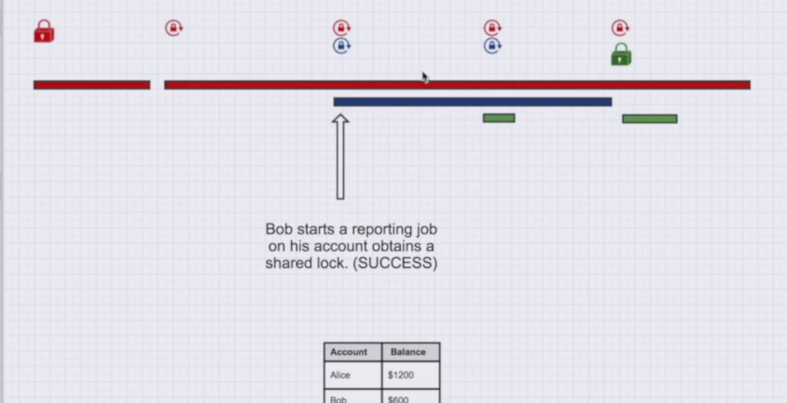
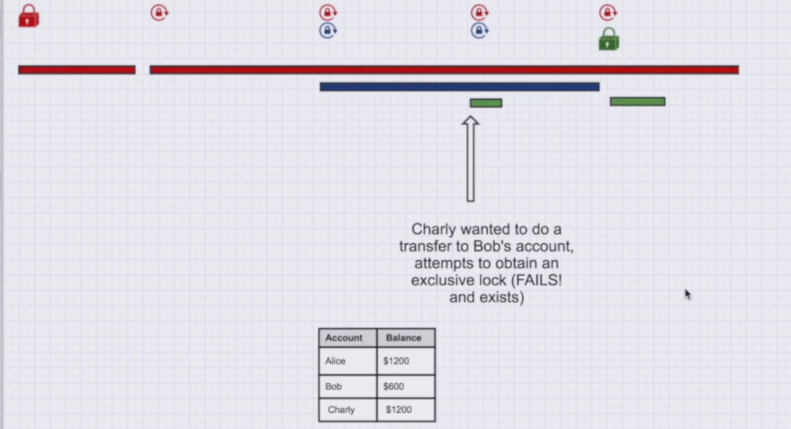
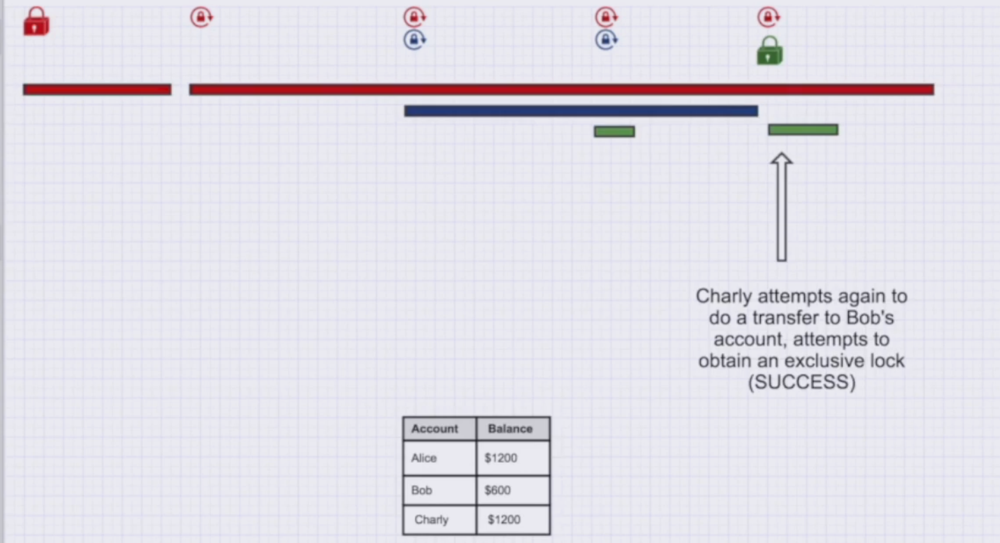

# EXCLUSIVE VS SHARE LOCK

## What Is an Exclusive Lock?

When I am reading or modifying data, I may want to prevent other transactions from accessing the same data in a conflicting way.

An **Exclusive Lock (X-Lock)** allows one transaction to exclusively work with the locked data. No other transaction can obtain a **Shared Lock** or another **Exclusive Lock** on the same data.

## What Is a Shared Lock?

When I want to read data, I may want to make sure that no other transaction can modify that data while I am reading it.

A **Shared Lock (S-Lock)** allows multiple transactions to read the same data at the same time, but no transaction can obtain an **Exclusive Lock** on the same data while the shared locks are held.

**If I obtain an Exclusive Lock, there must not be any Shared Lock on the same data.**

**If I obtain a Shared Lock, there must not be any Exclusive Lock on the same data.**

> We use **X-Locks** and **S-Locks** to help maintain consistency and control concurrent access to data.

<p>
  
  
  
  
  
</p>

If we insert a unique value in one transaction and another transaction tries to insert the same value before the first transaction commits, the value can be locked by the first transaction.

The second transaction must wait until the first transaction **commits or rolls back**.

## Physical Levels of Locking

1. **Database Lock:** Locks the entire database.

2. **Table Lock:** Locks the entire table. Depending on the lock mode, other transactions may need to wait before reading or modifying the table.

3. **Row Lock:** Locks specific rows. It can be more expensive to manage because the DBMS needs to track many locked rows inside the memory.

4. **Column Lock:** Locks specific columns.

## 2 Phase Locking

In **Two Phase Locking (2PL)**, a transaction goes through two phases:

1. **Growing Phase:** The transaction can acquire locks but cannot release them.
2. **Shrinking Phase:** The transaction can release locks but cannot acquire new ones.

For example:

```text
Lock 1 → Lock 2 → Release 2 → Release 1
```

## SELECT ... FOR UPDATE

We can use `SELECT ... FOR UPDATE` to acquire an **exclusive row level lock** on the selected rows, preventing other transactions from modifying or locking those rows in conflicting ways.

The locks are held until the transaction **commits or rolls back**.

This can be useful for preventing **race conditions** in systems such as booking systems.

## In PostgreSQL

If two transactions try to update the same row at the same time, PostgreSQL automatically uses row level locking.

The second transaction waits until the first transaction releases its lock. After the first transaction commits, the second transaction can continue and work with the updated row.

## Optimistic Databases

In an **optimistic concurrency control** approach, transactions can execute concurrently without acquiring all the locks needed to prevent conflicts in advance.

When a transaction is ready to commit, the system checks for conflicts.

If a conflict is detected, the transaction may be **rolled back and retried**.
