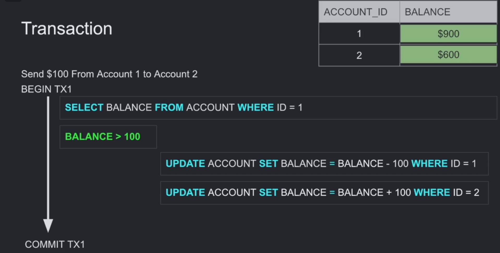

 TRANSACTION

## What is a Transaction?

**Transaction:** A collection of operations that represents one unit of work.

> Example: Account deposit (`SELECT`, `UPDATE`, `UPDATE`)

## Where Do We Really Want to Use Transactions?

The concept of a transaction is usually used to **change** and **modify** data.

However, it can also be used for **reading** data, such as when we need to fetch sensitive data and then create a report or perform analytics on this data, and we want to get a consistent snapshot based on the state of the data at the time of the transaction.
