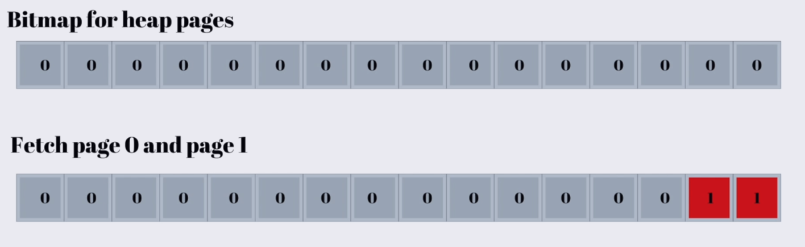

# BITMAP

## Why Do We Use Bitmap?

When the database planner estimates that a query will return a large number of rows, using a normal **Index Scan** may become inefficient.

With an Index Scan, we scan the index, find the matching `row_id` / TID, and then go to the heap to fetch the corresponding rows. If there are many matching rows, this may cause many random I/O operations, making it more expensive than a Sequential Scan.

So, the planner may choose:

1. **Index Scan** → when relatively few rows are expected.
2. **Bitmap Scan** → when many rows are expected, but using the indexes can still be beneficial.
3. **Sequential Scan** → when a very large portion of the table is expected to match.

The planner makes this decision based on the estimated **cost** of each scan type.

---

## What Is the Bitmap?

A bitmap is used to collect the locations of matching rows before fetching the actual table data.

After scanning the index, we don't immediately fetch the matching rows. Instead, we store their locations in the bitmap.

Then, we fetch the heap pages that contain the matching rows and recheck the filter because we are working with pages/locations rather than directly fetching each row.



---

### The Best Use Case for Bitmap Is ANDing Queries

We have two indexes, one on `name` and one on `age`:

```sql
SELECT name
FROM grades
WHERE name = 'sultan'
  AND age = 21;
```

| Bitmap | Page 1 | Page 2 | Page 3 | Page 4 | Page 5 |
|---|---:|---:|---:|---:|---:|
| Name | 1 | 1 | 0 | 1 | 0 |
| Age | 0 | 1 | 1 | 1 | 0 |
| AND | 0 | 1 | 0 | 1 | 0 |

Here, we can decrease the number of heap page fetches by combining the two bitmaps using an **AND** operation, requiring only **2 page fetches instead of 4**: 1 for `name`, 1 for `age`, and 2 additional fetches when combining them.
