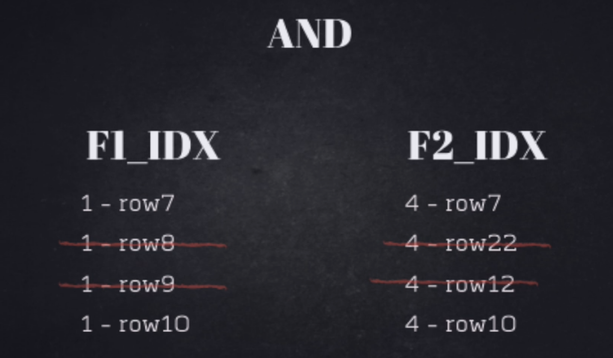
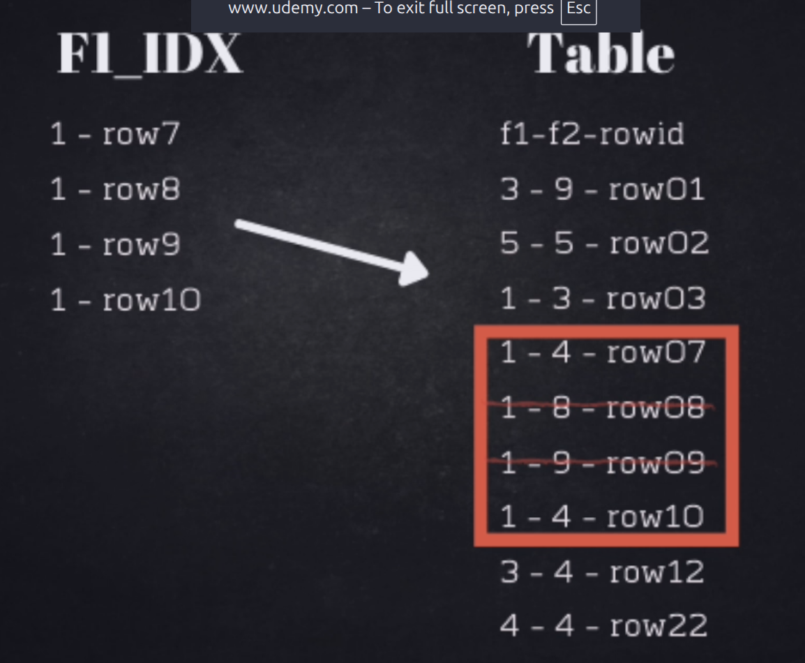
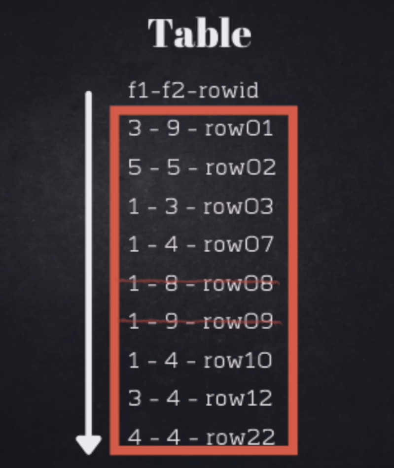

# HOW DATABASE DECIDES TO USE INDEXES

The SQL planner can choose different execution plans depending on the estimated cost and the amount of data that each index may return.

1. **Search using both indexes:**
   The planner may search using both indexes if combining them is estimated to be efficient and the index scans do not return too much or too little data.

    

2. **Use one index first:**
   The planner may search using one index if this index return small results and the other return many rows, fetch the required pages from the heap, and then apply the second filter to those pages.

    

3. **Use a sequential scan:**
   The planner may choose a sequential scan when it is cheaper than using an index.

   For example, if we have only **3 rows** in a table and then insert **3 million rows**, the planner needs updated statistics to make accurate decisions about the query plan. If the statistics have not been updated yet, the SQL planner may choose an inefficient plan because it is working with outdated metadata.

    

> The SQL planner chooses the execution plan based on the **estimated cost**, which depends on statistics, selectivity, table size, indexes, and other factors.

> You can forcing database to use what index you want by adding a comment in a query.

