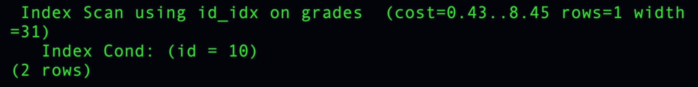

# INDEX

## What Is an Index?

**Index:** A data structure (B-tree) separate from the heap that has pointers to the heap. It contains only some of the data and is used to search quickly. Once you find the value in the index, you go to the heap to fetch more information. It is also stored in pages and requires I/O operations to fetch.

* Every primary key has an index by default.

* Every index includes the primary key as a column in its entries by default.

* A covered query is faster than another query.

## Scan Planner

If we have an index on `id` and `grade`:

1. `SELECT * FROM grades;`

   This is the worst query because we need to read the whole table without any filter from the disk, and we need all columns, so we need more **BW** in the TCP channel.

2. `SELECT * FROM grades ORDER BY grade;`

   In this query, we need to perform an index scan and then fetch the ordered rows from the table.

3. `SELECT * FROM grades ORDER BY grade;`

   Here, we need to fetch all rows into memory and then sort them in memory before sending them through the TCP channel. Some databases run this sort using multiple threads and then merge the results together.

## What Do We Get from `EXPLAIN`?

In `EXPLAIN`, we get approximately four things that come from the table metadata:

1. The time needed to fetch the first row.

2. The time needed to fetch the last row.

3. The number of rows returned by the query.

4. The size of one row in bytes.

### Query Execution Plan

`EXPLAIN` also shows us how the query will be executed, such as using an **index scan**, **sequential scan**, **index-only scan**, etc.

