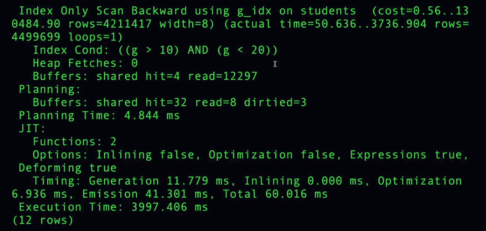

# KEY VS NONKEY INDEXING

## Covered Query

The best queries are those where everything we need is included in the index (**covered query**), so we don't need to go to the heap to fetch the rows (**index only scan**).

### Key

When we create a composite index, we specify the columns we want as **key columns**. These columns can be used to search or sort.

For example:

```sql
CREATE INDEX idx_grades_name_age
ON grades (name, age);
```

This creates an index ordered by `name` and then by `age`. This may slightly increase the cost of modifying the table, but it helps with reading and sorting.

If we only select `name` and `age`, we don't need to go to the heap to fetch the rows.

| row_id | name   | age |
| ------ | ------ | --: |
| 2      | ahmad  |  23 |
| 1      | ahmad  |  25 |
| 4      | omar   |  44 |
| 3      | sultan |  22 |

> `row_id` indicates the order in which the rows were inserted into the table.

If we add other columns to the index, they are also ordered after `name` and `age`.

<p>
  
  
  
</p>

### Non Key

When we create a composite index, we can also **include** additional columns that are not part of the index key. These columns can help us with reads without affecting the ordering of the index.

For example:

```sql
CREATE INDEX idx_grades_name_age
ON grades (name) INCLUDE (age);
```

This creates an index ordered by `name` and only includes `age` as an additional column to help with reads.

If we only select `name` and `age`, we don't need to go to the heap to fetch the rows.

| row_id | name   | age |
| ------ | ------ | --: |
| 1      | ahmad  |  25 |
| 2      | ahmad  |  23 |
| 4      | omar   |  44 |
| 3      | sultan |  22 |

> `row_id` indicates the order in which the rows were inserted into the table.

If we add other columns to the index, they are included after the key column `name`, but they are not used to order the index.
