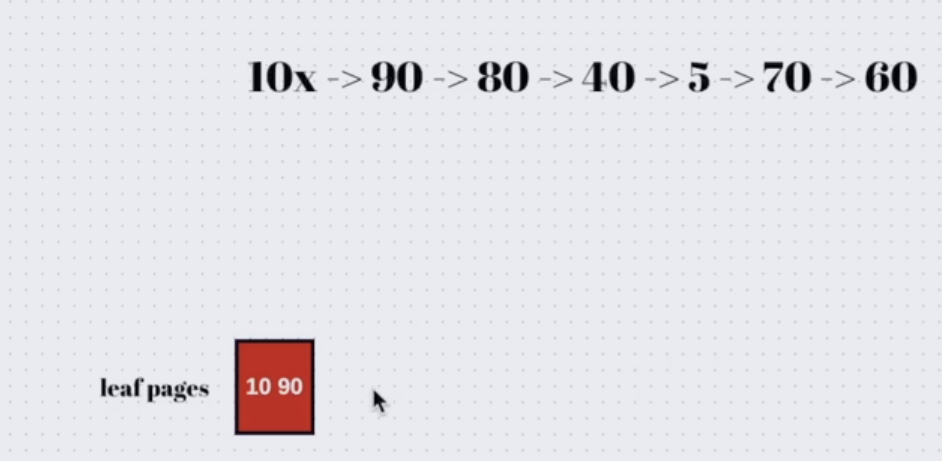

# UUID

## What Is a UUID?

A **UUID (Universally Unique Identifier)** is a universally unique identifier generated in a way that makes collisions extremely unlikely.

## Why Does It Affect Performance?

Because UUIDs are typically random, using them as a primary key can affect performance. Since a primary key usually has an index, and some DBMSs organize the table based on the primary key, inserting random values can cause additional page splits and reorganizations.

> As an example, here the page size is `2`, and we need to split the pages several times just to insert 7 values. Now imagine how many rows may need to be shifted from the beginning to the end.

  
  

## What Happens?

For each insert, we may need to shift rows inside the pages so the new row can be placed in the correct position.

Therefore, we may need to fetch and modify many pages, which can lead to many I/O operations.

## What Is UUID Good For?

UUIDs are useful because they are **universally unique**, so they can be generated by the client before the request reaches the database server.

## Issue with Sequential Keys

Automatically generated sequential keys cannot always be generated by the client.

In a multithreaded environment, where many transactions may try to insert rows at the same time, multiple users may need to generate a new sequential value concurrently. Therefore, synchronization mechanisms such as **locks** may be required to avoid race conditions.
