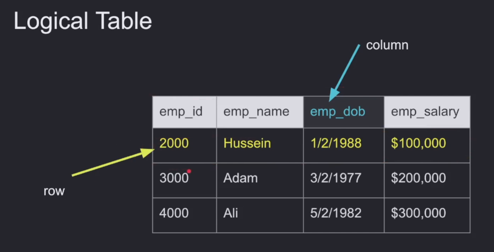
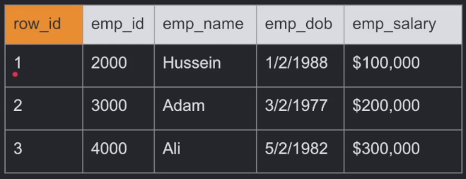
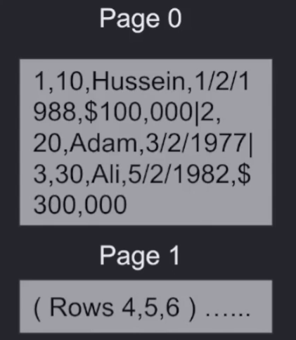
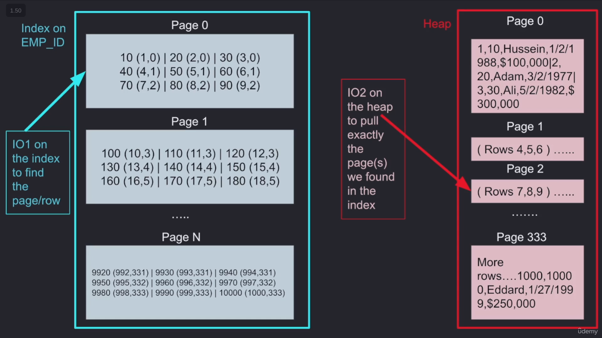

# DISK

## How Are Tables and Indexes Stored on Disk?

We store all tables and indexes inside separate pages on the disk.

## Storage Concepts

* **Table:** A combination of rows and columns used to store data.

  

* **Row_id:** An internal ID maintained by the system in certain DBs (MySQL). In some databases, it is the same as the primary key, while other DBs have a system column called `row_id` to uniquely identify the row.

  

* **Page:** Depending on the storage model (row vs. column store), rows are stored and read in logical pages. The DB **doesn't** read a single row; it reads a page or more in a single I/O operation.

### Small vs. Large Pages

Small pages are faster to read and write, especially if the page size is close to the media block size. However, the overhead cost of the page header metadata compared to useful data can become high.

On the other hand, larger page sizes can minimize metadata overhead and page splits, but at the cost of higher cold read and write times.

* **I/O:** All operations requested from the disk are I/O operations. Therefore, we want to minimize the number of I/O operations because they are expensive. Some I/O operations in the OS go to the OS cache instead of directly to the disk.

* **Heap:** A data structure stored in pages where the table data is stored. Traversing the heap can be expensive because we may need many I/O operations to fetch the required pages.

* **Index:** Another data structure (B-tree) separate from the heap that has pointers to the heap. It contains only some of the data and is used to search quickly. Once you find the value in the index, you go to the heap to fetch more information. It is also stored in pages and requires I/O operations to fetch.

