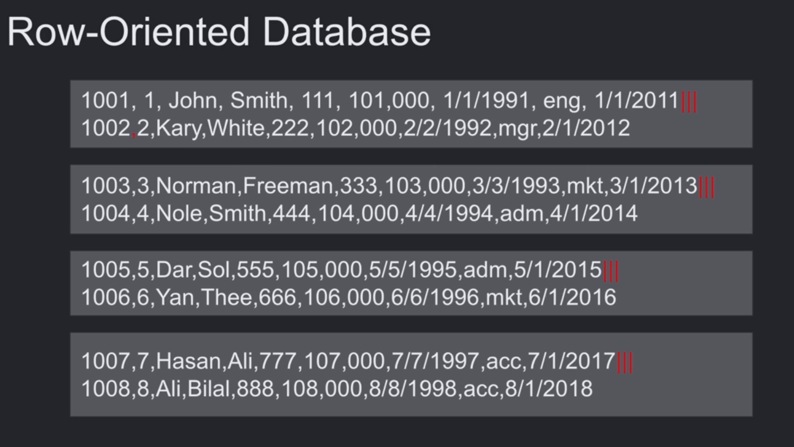
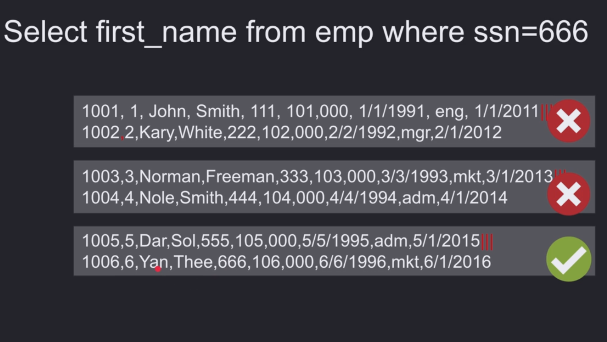
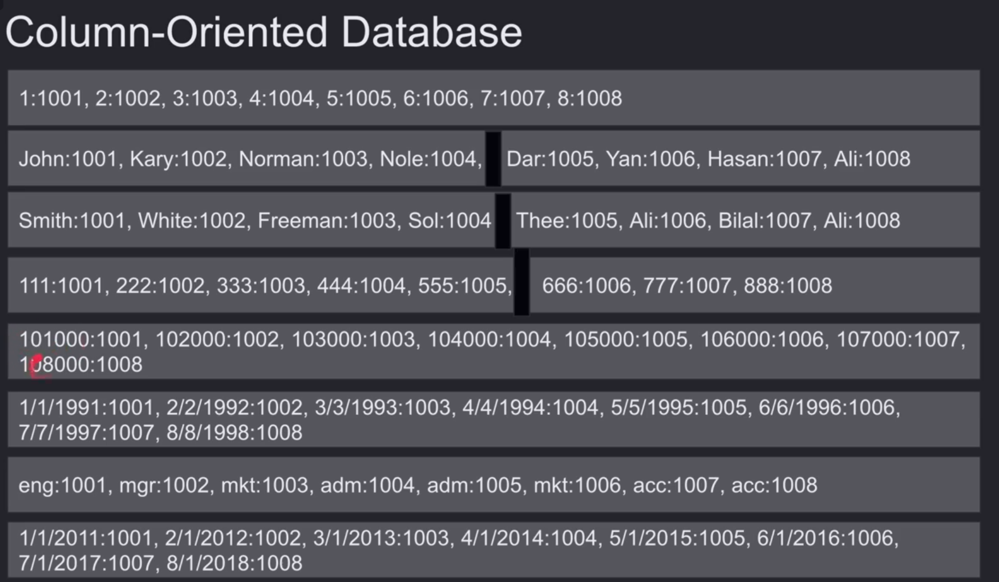
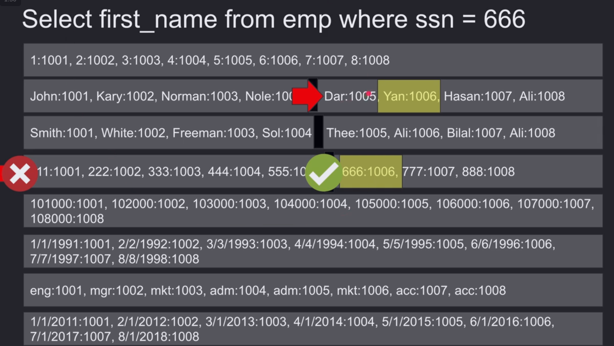
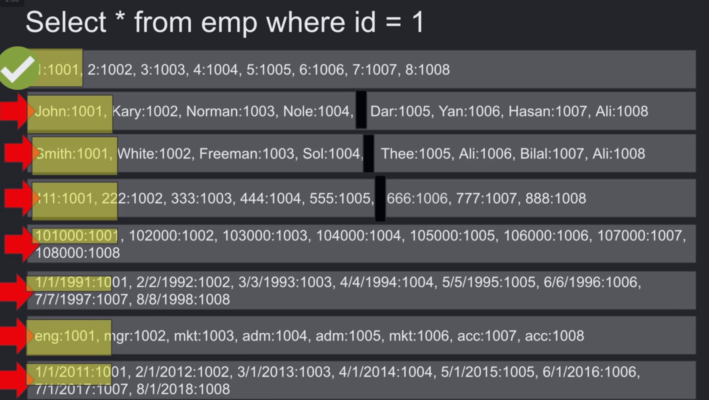
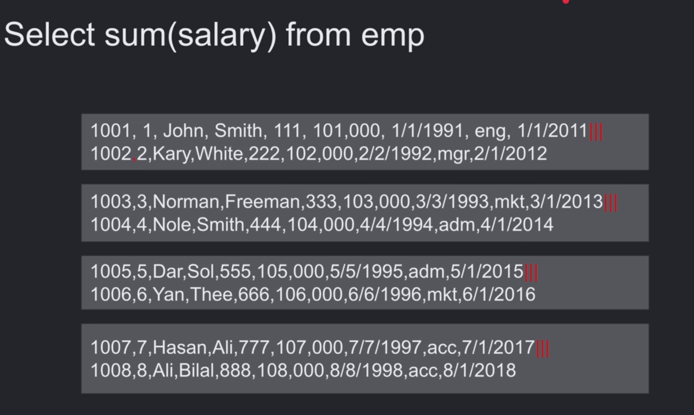
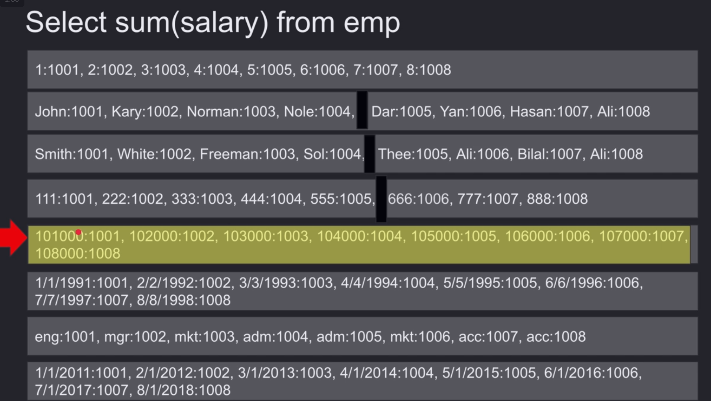

# ROW VS COLUMNS

## How Do We Structure the Table Inside Pages?

### Row-Oriented Databases

* Tables are stored as contiguous rows on the disk inside each page. A single I/O can fetch multiple rows.

* More I/O operations are required to search for or find a particular value in a column.

> As an example, here we need 3 I/Os to find the row.

* After finding a row, you get all columns for that row.

### Column-Oriented Databases

* Tables are stored as columns first on the disk inside each page. A single I/O can fetch multiple values from a column.

* Each value is associated with a `row_id`, and the database has metadata to map all `row_id`s to logical pages and then to physical blocks.

* Fewer I/O operations are required to get more values from a specific column or to search for specific values.

> As an example, here we need 2 I/Os to find the row and then another one to fetch the name mapped from the `row_id`.

* Working with multiple columns requires more I/Os to fetch these columns.

> As an example, here we need to fetch 8 pages just to get the information of one row.

* If we insert, delete, or update one row, we need to update multiple pages. Therefore, we need many I/Os, which is expensive.

* Column-oriented databases are best for **aggregation functions** because aggregations are usually performed on a specific column. Therefore, fewer I/Os are needed to fetch all the values of one column.

  
  

## Summary

| Row                                            | Column                                           |
| ---------------------------------------------- | ------------------------------------------------ |
| Optimal for read/write operations              | Writes are slower                                |
| Compression isn't as efficient                 | Compression is highly efficient                  |
| Aggregation isn't as efficient                 | Amazing for ggregation |
| Efficient for queries that access many columns | Inefficient for queries that access many columns |

**Most databases use row-oriented storage by default, but some databases allow you to choose the storage model for each table.**
