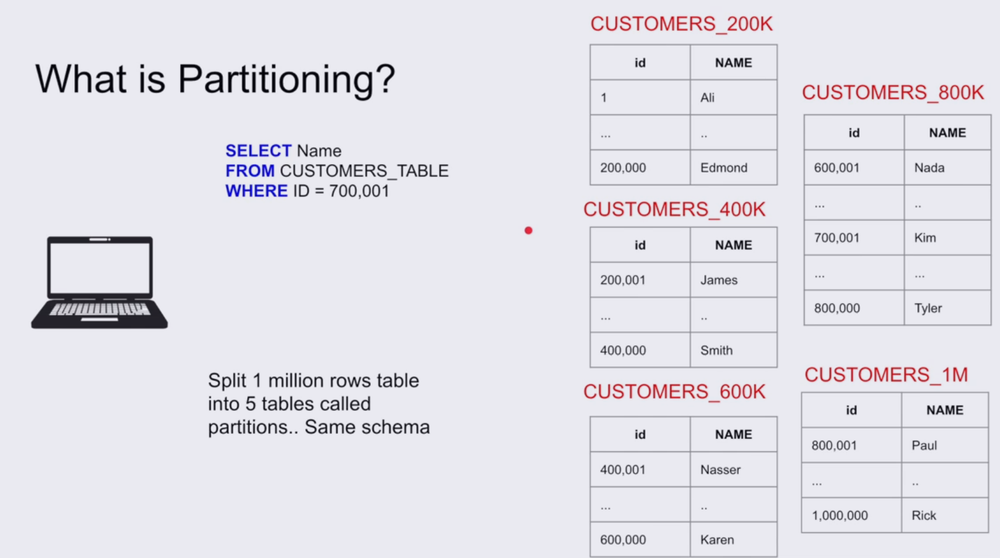
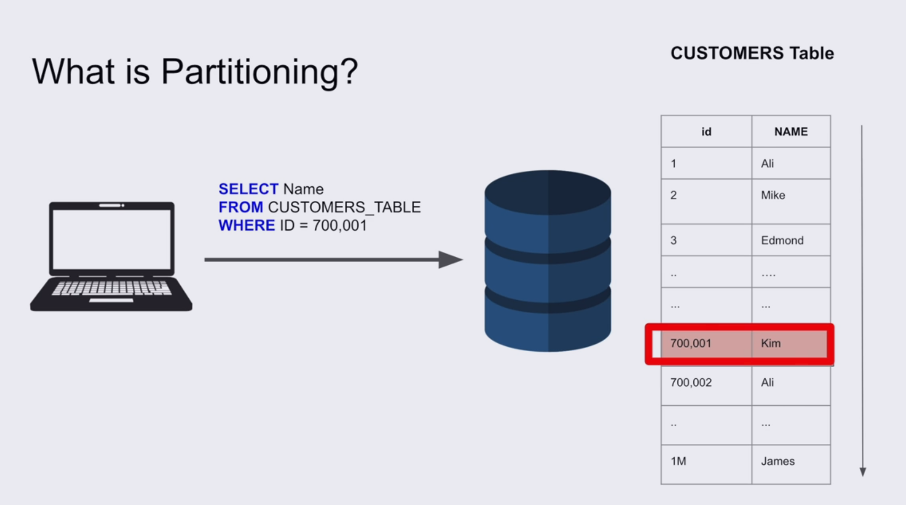

# PARTITIONING

## What Is Partitioning?

**Partitioning:** Splitting a table inside a database into multiple smaller partitions. When we access the original table, the DBMS uses metadata and a **partitioning key** to determine which partition contains the required data.



## Why Do We Need Partitioning?

If a table has a very large number of rows, scanning the entire table can take more time when executing a query.



## Horizontal vs Vertical Partitioning Strategy

* **Horizontal Partitioning**

  Splits the rows into partitions based on a range, list, or hash.

* **Vertical Partitioning**

  Splits the columns into separate partitions. Large columns that are accessed less frequently can be stored separately, potentially on slower storage.

## Partitioning Types

1. **Range:** Partition data by a range, such as dates or IDs. This can also be useful for moving old data to slower archive storage.

2. **List:** Partition data by discrete values, such as cities (`Amman`, `Zarqa`, `Aqaba`).

3. **Hash:** Partition data using a hash function.

## Pros of Using Partitioning

1. Improves query performance when the query only needs to access one partition.

2. Allows old data that is rarely accessed to be archived on cheaper storage.

## Cons of Using Partitioning

1. Updates that move a row from one partition to another can be slower.

2. An inefficient query could accidentally scan all partitions.

## Horizontal Partitioning vs Sharding

* **Horizontal Partitioning:** Splits a large table into multiple partitions within the same database server. The client is agnostic; it sends the same query, and the DBMS handles which partition should be accessed.

* **Sharding:** Splits a large table across multiple database servers.

* In **horizontal partitioning**, the physical storage of the table is divided into partitions, but the client still interacts with the same database.

* In **sharding**, the data is distributed across different servers, which can make operations such as transactions more complex.

## SQL Example

```sql
CREATE TABLE grades (
    id INT,
    name VARCHAR(100),
    grade INT
)
PARTITION BY RANGE (grade);
```

Create two partitions:

```sql
CREATE TABLE grades_below_50
PARTITION OF grades
FOR VALUES FROM (MINVALUE) TO (50);
```

```sql
CREATE TABLE grades_50_and_above
PARTITION OF grades
FOR VALUES FROM (50) TO (MAXVALUE);
```

Insert some data:

```sql
INSERT INTO grades (id, name, grade)
VALUES (1, 'Ahmad', 40);
-- This row goes to grades_below_50
```

```sql
INSERT INTO grades (id, name, grade)
VALUES (2, 'Sultan', 70);
-- This row goes to grades_50_and_above
```

The client inserts into the original `grades` table, and the DBMS automatically routes each row to the correct partition based on the `grade` value.
