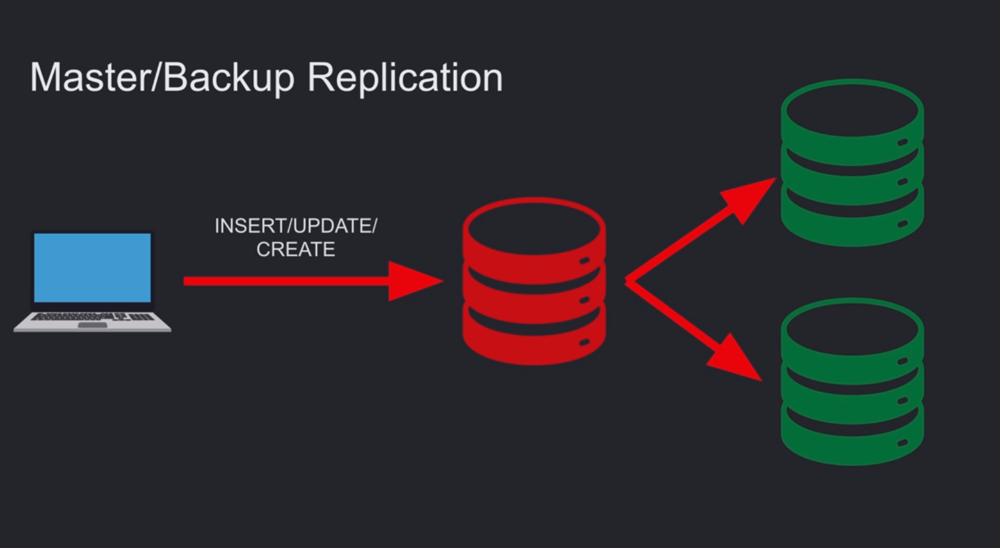
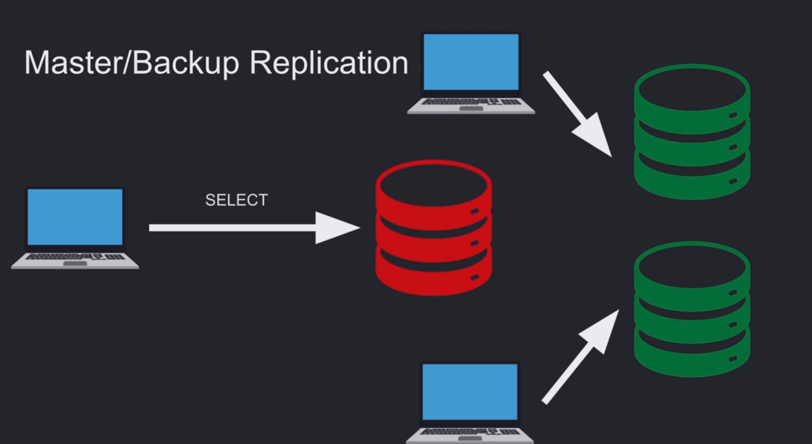

# REPLICATION

## What Is Replication?

**Replication:** A way to have one **primary node** that accepts writes and multiple **replica nodes** that receive those writes from the primary.

When the primary server goes down, a replica can take over to ensure **availability**. Replication can also improve read performance by allowing read queries to be distributed across multiple servers.

**The primary node can accept both read and write queries, while replica nodes can accept read queries only.**

We can also scale write operations by using **multi primary (multi master) replication**, but this is much more complex.

### Writing to the Replica

### Reading from the Replica

## Why Do We Need Replication?

1. **Improve read performance:** Split the load of read requests across multiple servers.

2. **Reduce latency:** With **region based replication**, users can read from a replica that is geographically closer to them, reducing network latency.

3. **Ensure availability:** If the primary server goes down, a replica can take over.

## We Can Replicate Nodes Based On

1. **Region:** Replicas can be placed in different geographical regions.

2. **Provider:** Replicas can be distributed across different cloud or infrastructure providers.

3. **Other strategies:** Replication can also be configured based on the system's requirements.

## Sync vs Async

* **Sync:** A write transaction on the primary waits until the required replicas have also written the data before the write is considered successful. This provides stronger consistency guarantees but can increase write latency.

* **Async:** A write transaction is considered successful once it is written to the primary. The changes are then asynchronously sent to the replicas.

  **Async replication can lead to eventual consistency** when we read data from replicas and the data has not yet been replicated from the primary.

## Pros of Using Replication

1. **Faster reads:** Read requests can be distributed across multiple servers.

2. **Lower latency:** Region based replication can reduce network latency by serving users from nearby replicas.

3. **Higher availability:** A replica can take over if the primary server goes down.

## Cons of Using Replication

1. **Eventual consistency:** Async replication can temporarily return stale data from replicas.

2. **Slower writes:** Sync replication can increase write latency because the primary may need to wait for replicas.
