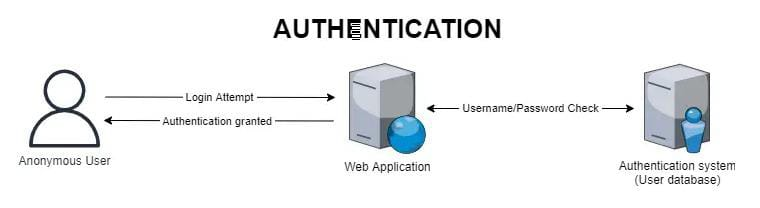

# AUTHENTICATION

Authentication is the process of verifying the identity of a user.

We can add a **password** to users to prevent anyone from **impersonating the user** and accessing their account as if they were that user.

