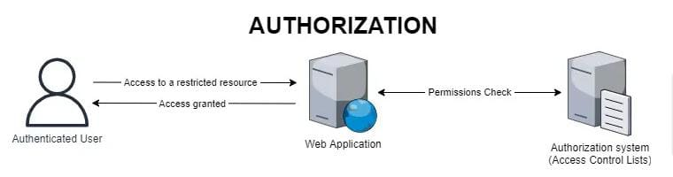

# AUTHORIZATION

Authorization is the process of determining what an authenticated user is allowed to do.

When we first create a database, we may have a **root user** with all permissions.

Then, when we create a new user from the root user, or from another user that has permission to create users, we can assign specific permissions to the new user.

These permissions can include **CREATE**, **READ**, and **DDL** operations.

## Users and Permissions

| User      | CREATE | READ | DDL |
| --------- | ------ | ---- | --- |
| Admin     | ✅      | ✅    | ✅   |
| Developer | ✅      | ✅    | ❌   |
| Viewer    | ❌      | ✅    | ❌   |

