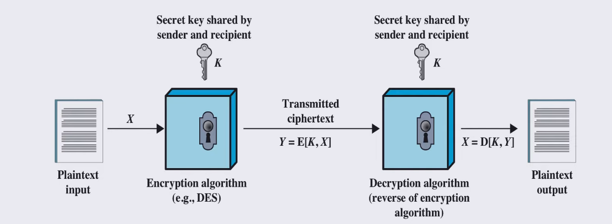
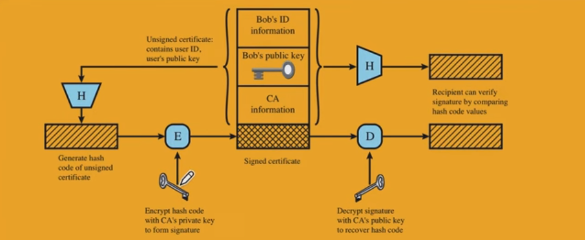
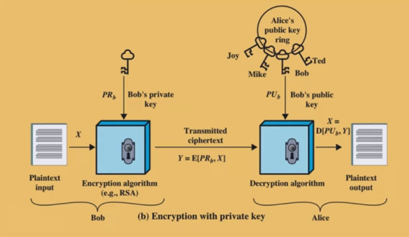

# ENCRYPTION

Encryption adds another layer of security by encrypting the actual data stored on the disk.

Even if a physical attack occurs and someone steals the disk, they cannot read the data without the required decryption key.

## Symmetric Encryption

In **symmetric encryption**, we use the same key to encrypt and decrypt data.

This type of encryption is commonly used to provide **confidentiality** for stored data.

   

## Asymmetric Encryption

In **asymmetric encryption**, we have two keys:

* **Public Key**
    
* **Private Key**
    
Each key can be used to encrypt data that can only be decrypted with the corresponding key.

```text
Encrypt with Public Key A → Decrypt with Private Key A
```
This is used for **confidentiality**.

```text
Encrypt with Private Key A → Verify/Decrypt with Public Key A
```
This is used for **authentication**.

## Why Can't We Always Encrypt Data in the Database?

1. **Querying:** Many queries require the data to be available in plaintext, especially when performing comparisons or calculations.

2. **Analysis and Indexing:** Data analysis and indexing may require access to the actual data values, which can be difficult when the data is encrypted.
