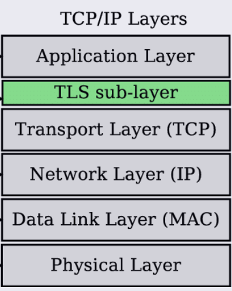

# NETWORK SECURITY

## What Is Network Security?

**Network Security:** A set of mechanisms and practices used to protect data and communication between systems while it is being transmitted over a network.

## TLS

**TLS (Transport Layer Security):** A protocol used to encrypt data while it is being transmitted between the client and the database server. This protocol works on top of **TCP**.

TLS helps protect data from being read or modified while it is traveling through the network, such as in a **Man-in-the-Middle (MITM) attack**.

We need to configure **certificate** and **key** files to establish a secure TLS connection.

  