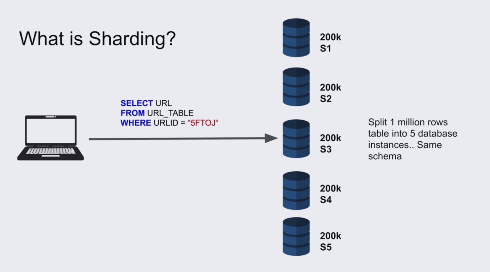
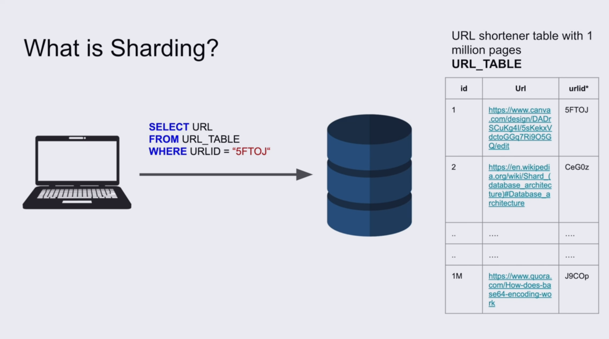

# SHARDING

## What Is Sharding?

**Sharding:** Splitting a database into multiple smaller databases and putting each database on a separate server. The client is responsible for determining where to insert the data and from which server to fetch the data to avoid accessing the wrong server.



## Why Do We Need Sharding?

1. If a table has a very large number of rows, the index also becomes large, so scanning the index can become slower.

2. If we have a large number of requests to the database and one server cannot handle all the requests.

3. All TCP connections go to the server, which can overwhelm the server and require more bandwidth in the channels.



## How Can We Assign the Correct Server for the Query?

We can use a **consistent hashing function** on the client side to map data to a specific server when inserting it.

We can also use the hash result when querying to determine which server contains the required data.

### Simple Pseudo-Code

```text
function getServer(user_id):
    hash = consistentHash(user_id)
    server = hash.getServer()
    return server


// Insert
server = getServer(user_id)
server.insert(data)


// Read
server = getServer(user_id)
server.find(user_id)
```

The same `user_id` will be mapped to the same shard, so the client knows which server to access.

## Pros of Using Sharding

1. **Scalability:**

   * **Data:** We can distribute the data across multiple servers instead of storing a huge number of rows on one server.
   * **Resources:** We add a new complete physical server with its own CPU, RAM, storage, and network resources.

2. **Security:** Users can access only certain shards by adding access control to the shard servers.

3. **Optimal and smaller index size:** Each server has a smaller amount of data, so the indexes on each server can also be smaller.

## Cons of Using Sharding

1. **Complexity:** The client needs to be aware of the sharding strategy and know which server each query should go to.

2. **Transactions and rollbacks:** Transactions and rollbacks across multiple shards are more difficult to handle.

3. **Schema changes:** If we need to add a field to a table, we need to apply the change to all shards.

4. **Joins:** Joining data across multiple shards is more difficult because the data is distributed across different databases and servers. In partitioning, joining data is easier because the partitions are inside the same database on the same server.
